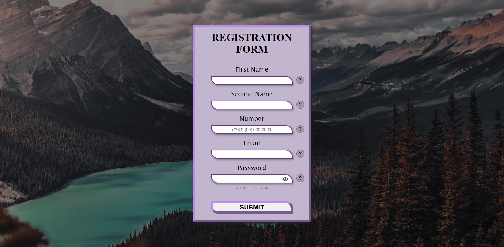
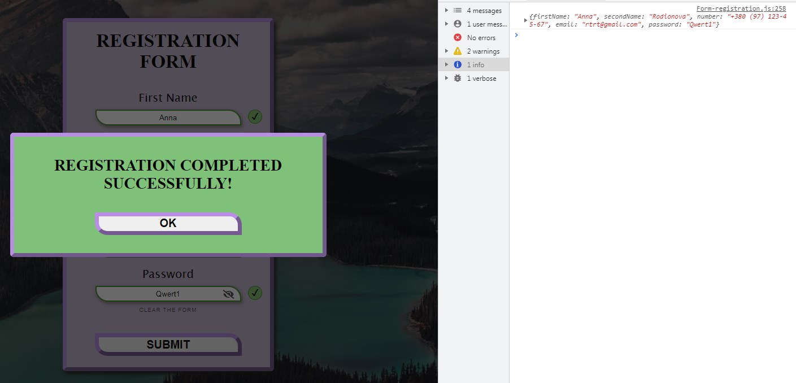

# [View preview](https://drkl151.github.io/registration-form.js/Form-registration)

## Registration form written in Javascript

* There are validity checks
* There are hints for the user
* There are marks indicating successful filling
* There is a button to clear the form
* Regular expressions are used


> Upon successful completion, we will get the data object to the console

__Dynamic function is used to return inputs to their default state:__
```javascript
function returnDefaultInput(selector, value, firstProperty, secondProperty) {
    const getSelector = document.querySelectorAll(selector);

    getSelector.forEach(item => {
        secondProperty ? item[firstProperty][secondProperty] = value : item[firstProperty] = value;
    })
}
```